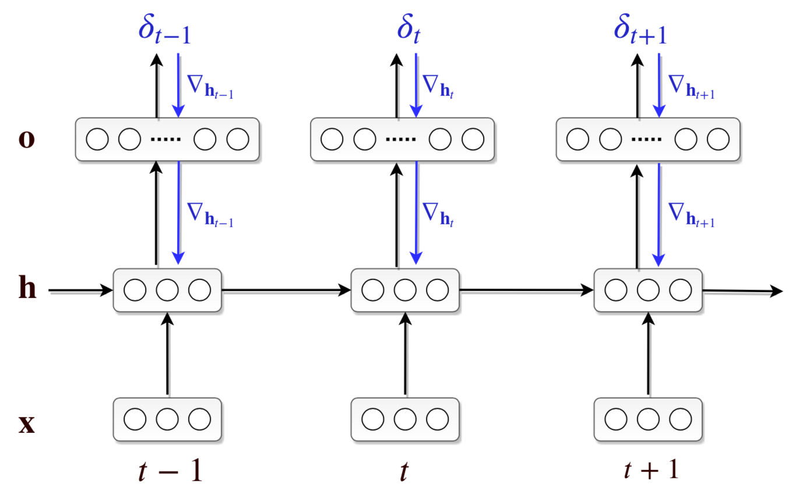

# Recoding latent sentence representations
## Dynamic gradient-based activation modification in RNNs

 

This is the repository for my Master thesis in Artificial Intelligence written during Summer term 2019 at the Universiteit van Amsterdam.
The full thesis is available online [here](https://www.dropbox.com/s/v0awwvk6xmax3zy/ulmer_thesis.pdf?dl=0).

### Description

In Recurrent Neural Networks (RNNs), encoding information in a suboptimal or erroneous way can impact the quality of 
representations based on later elements in the sequence and subsequently lead to wrong predictions and a worse model performance. 
In humans, challenging cases like garden path sentences (an instance of this being the infamous *The horse raced past the barn fell*) can lead their language understanding astray. 
However, they are still able to correct their representation accordingly and recover when new information is encountered. 
Inspired by this, I propose an augmentation to standard RNNs in form of a gradient-based correction mechanism. 
The mechanism explored in this work is inspired by work of Giulianelli et al., 2018, who demonstrated that activations in a LSTM can be corrected in order to recover corrupted information (interventions). 
In my thesis, I present a generalized framework and implementation based on this idea to dynamically adapt hidden activations based on local error signals (recoding).
I explore signals which are either based directly on the task’s objective (*surprisal*) or on the model’s confidence (in the form of its *predictive entropy*), leveraging recent techniques from Bayesian Deep Learning (Gal and Ghahramani, 2016b; Gal and Ghahramani, 2016a; Pearce et al., 2018).
Crucially, these updates take place on an activation rather than a parameter level and are performed during training and testing alike. I conduct different experiments in the context of language modeling, where the impact of using such a mechanism is examined in detail.
All models are evaluated on the Penn Treebank using a Language Modeling objective.

### Findings

TODO

### Usage

To run any code in this repository, first clone the repository and install the requirements:

    git clone https://github.com/Kaleidophon/tenacious-toucan.git
    pip3 install -r requirements.txt
    
### Replication of main results

TODO

#### Replication of Gulianelli et al. (2018)

To replicate the finding of Gulianelli et al. (2018), simply run the following the following script:

    sh replicate_giulianelli.py
    
This script performs the following steps:

1. Converting the corpora into the right format. 
2. Downloading the trained language model by Gulordava et al. (2018).
3. Extracting the activations from a corpus using the very same model.
4. Training classifiers on these activations that try to predict the numerosity of the verb based on hidden activations.
5. Replicating the experiments described in the paper (number agreement accuracy with and without interventions and 
whether these influence the perplexity values in a statistically significant way)

Any settings for these steps can be changed by either changing the corresponding config files inside the `config` directory
or running the corresponding scripts individually and supplying arguments via the command line (command line arguments override
config options).

This script might take while to execute, to better run it in the background and get yourself a cup of coffee in the 
meantime :coffee:

Lastly, it should be noted that the training of the Diagnostic Classifiers introduces some randomness into the 
replication, because the training splits are generated randomly everytime, and differently trained Diagnostic Classifiers
therefore also impact the effects of interventions in a different way. To repeat the experiments with different classifiers
again, delete the results in `data/classifiers/giulianelli/models` and `data/classifiers/giulianelli/preds` and execute 
`replication/classify.py` and `replication/replicate.py` again.

### References

Giulianelli, Mario, et al. "Under the Hood: Using Diagnostic Classifiers to Investigate and Improve how Language Models Track Agreement Information." arXiv preprint arXiv:1808.08079 (2018).

Gulordava, Kristina, et al. "Colorless green recurrent networks dream hierarchically." arXiv preprint arXiv:1803.11138 (2018).