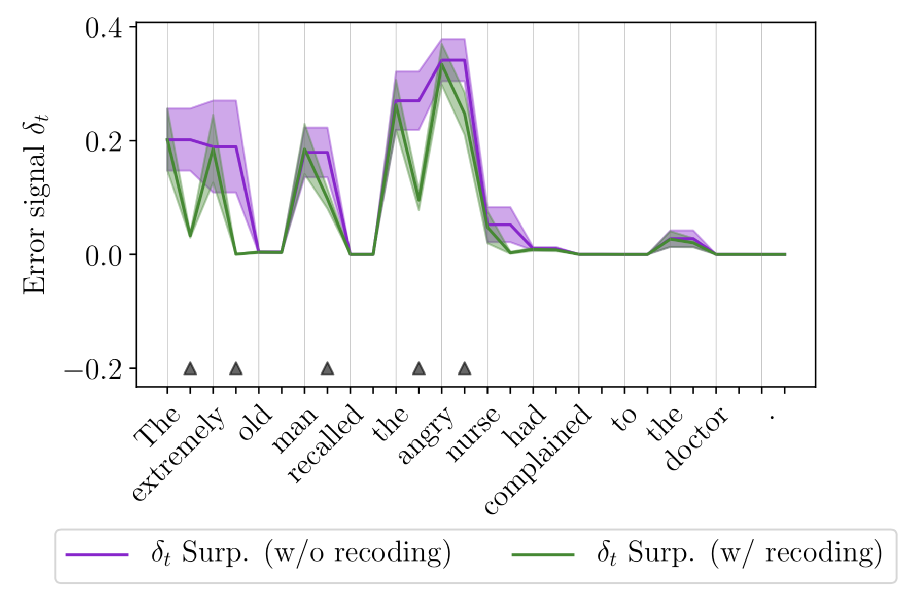
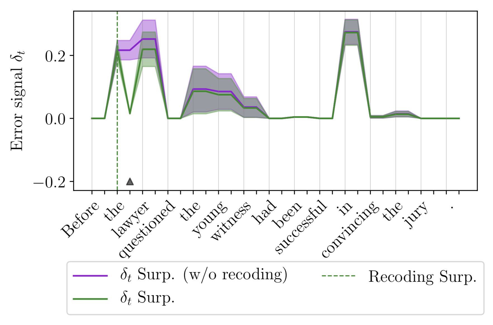

# Recoding latent sentence representations
## Dynamic gradient-based activation modification in RNNs

 

This is the repository for my Master thesis in Artificial Intelligence written during Summer term 2019 at the Universiteit van Amsterdam.
The full thesis is available online [here](https://www.dropbox.com/s/v0awwvk6xmax3zy/ulmer_thesis.pdf?dl=0).

### Description

In Recurrent Neural Networks (RNNs), encoding information in a suboptimal or erroneous way can impact the quality of 
representations based on later elements in the sequence and subsequently lead to wrong predictions and a worse model performance. 
In humans, challenging cases like garden path sentences (an instance of this being the infamous *The horse raced past the barn fell*) can lead their language understanding astray. 
However, they are still able to correct their representation accordingly and recover when new information is encountered. 
Inspired by this, I propose an augmentation to standard RNNs in form of a gradient-based correction mechanism (*recoder*). 

The mechanism explored in this work is inspired by work of Giulianelli et al., 2018, who demonstrated that activations in a LSTM can be corrected in order to recover corrupted information (*interventions*). 

In my thesis, I present a generalized framework and implementation based on this idea to dynamically adapt hidden activations based on local error signals (*recoding*).
I explore signals which are either based directly on the task’s objective (*surprisal*) or on the model’s confidence (in the form of its *predictive entropy*), leveraging recent techniques from Bayesian Deep Learning (Gal and Ghahramani, 2016b; Pearce et al., 2018).
Crucially, these updates take place on an activation rather than a parameter level and are performed during training and testing alike. I conduct different experiments in the context of language modeling, where the impact of using such a mechanism is examined in detail.
All models are evaluated on the Penn Treebank using a Language Modeling objective.

### Findings

 

While the theoretical guarantees of recoding could be confirmed (see figures: On the left you can see how recoding lowers the
error signal encoded in hidden activations consistently compared to the same model not using recoding. On the right you can see
that in a recurrent setting, recoding even decreases the error signal at later time steps), empirical results show 
that the problem is a bit more challenging: When leveraging a completely unsupervised approach to recoding using the model's 
predictive entropy, the model sometimes becomes too confident about mispredictions and therefore performs worse than the baseline. 
In the case of supervised surprisal recoding, we can only observe miniscule improvements in the best case.

In short, this hints at the fact that most errors for Language Modeling in RNNs might not stem from faulty hidden activations but 
instead from other parts of the model that are not directly corrected by recoding, e.g. the embedding and decoding as well 
as all intermediate hidden layers. Refer to thesis chapter 7 and 8 for a more detailed discussion.

### Usage

To run any code in this repository, first clone the repository and install the requirements:

    git clone https://github.com/Kaleidophon/tenacious-toucan.git
    pip3 install -r requirements.txt
    
All the code was developed in Python 3.7, compatability with other versions is not guaranteed.
    
### Replication of main results

(Note: All the options for the different project scripts are not explore here, use `-h` or `--help` to find out 
about available command line arguments.)

The config files for the best found hyperparameters of the different models can be found in the `configs` folder:

* `configs/gpu_train_vanilla.json` - Training options for baseline
* `configs/gpu_train_surprisal.json` - Training options for recoding using the model's surprisal
* `configs/gpu_train_mcdropout.json` - Training options for recoding using the model's pred. entropy estimated with MC Dropout (Gal & Ghahramani, 2016b)
* `configs/gpu_train_ensemble.json` - Training options for recoding using the model's pred. entropy estimated with Bayesian Anchored Ensembles (Pearce et al., 2018)

In order to sample new configurations of hyperparameters, `parameter_search.py` can be used.

Then, use the main training script and specify the path of the corresponding config file to train a model, e.g.

    python3 train.py --config configs/gpu_train_mcdropout.json --step_type learned
    
Supplying more command line argument overrides parameters specified in the config file, in this case we are changing the
recoding step size from being a fixed value to an additional parameter that is being learned during the training. In case
you are training on CPU (not recommend), do not forget to supply `--device cpu`.

`eval.py` is used for simple evaluation of trained models. With `ablation.py`, the ablation study in chapter 5.3.5 can be performed,
where the effect of removing the recoder from a recoding model or adding the mechanism to a baseline model is assessed.

Finally, `qualitative.py` can be used to replicate the plots displayed in chapter 6 and this README. 

### Replication of Gulianelli et al. (2018)

To replicate the findings of Gulianelli et al. (2018), simply run the following the following script:

    sh replicate_giulianelli.py
    
This script performs the following steps:

1. Converting the corpora into the right format. 
2. Downloading the trained language model by Gulordava et al. (2018).
3. Extracting the activations from a corpus using the very same model.
4. Training classifiers on these activations that try to predict the numerosity of the verb based on hidden activations.
5. Replicating the experiments described in the paper (number agreement accuracy with and without interventions and 
whether these influence the perplexity values in a statistically significant way)

Any settings for these steps can be changed by either changing the corresponding config files inside the `config` directory
or running the corresponding scripts individually and supplying arguments via the command line (command line arguments override
config options).

This script might take while to execute, to better run it in the background and get yourself a cup of coffee in the 
meantime :coffee:

Lastly, it should be noted that the training of the Diagnostic Classifiers introduces some randomness into the 
replication, because the training splits are generated randomly every time, and differently trained Diagnostic Classifiers
therefore also impact the effects of interventions in a different way. To repeat the experiments with different classifiers
again, delete the results in `data/classifiers/giulianelli/models` and `data/classifiers/giulianelli/preds` and execute 
`replication/classify.py` and `replication/replicate.py` again.

### References

Gal, Yarin and Zoubin Ghahramani (2016b). „Dropout as a Bayesian approximation: Representing model uncertainty in deep learning“. In: International Conference on Machine Learning, pp. 1050–1059

Giulianelli, Mario, Jack Harding, Florian Mohnert, Dieuwke Hupkes, and Willem Zuidema (2018). „Under the Hood: Using Diagnostic Classifiers to Investigate and Improve how Language Models Track Agreement Information“. In: Proceedings of the 2018 EMNLP Workshop BlackboxNLP: Analyzing and Interpreting Neural Networks for NLP, pp. 240– 248

Gulordava, Kristina, Piotr Bojanowski, Edouard Grave, Tal Linzen, and Marco Baroni (2018). „Colorless Green Recurrent Networks Dream Hierarchically“. In: Proceedings of the 2018 Conference of the North American Chapter of the Association for Computational Linguistics:
Human Language Technologies, NAACL-HLT 2018, New Orleans, Louisiana, USA, June 1-6, 2018, Volume 1 (Long Papers), pp. 1195–1205

Pearce, Tim, Mohamed Zaki, Alexandra Brintrup, and Andy Neely (2018). „Uncertainty in Neural Networks: Bayesian Ensembling“. In: stat 1050, p. 12
